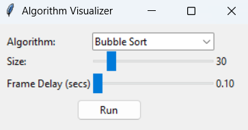
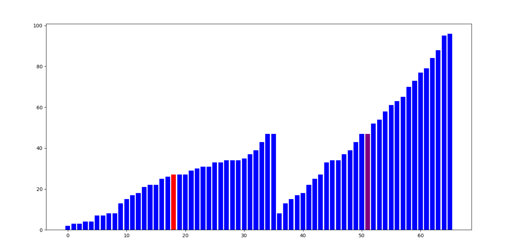

# DSA Visualisation Tool

This project is a tool for visualising common **sorting**, **searching**, and **graph traversal** algorithms. Built with
`matplotlib`, it provides animated demonstrations of how each algorithm works. This is ideal for learning data
structures and algorithms interactively.

---

## Features

- <u>Sorting Visualisations</u>:
  - Bubble Sort
  - Selection Sort
  - Insertion Sort
  - Quick Sort
  - Merge Sort


- <u>Searching Visualisations</u>:
  - Linear Search
  - Binary Search


- <u>Tree Traversals</u>:
  - Depth-First Search (DFS)
  - Breadth-First Search (BFS)


- Adjustable speed slider
- Adjustable array size/depth

---

## Requirements

Install dependencies into a virtual environment (recommended):

```bash
python -m venv venv
source venv/bin/activate  # On Windows: venv\Scripts\activate
pip install -r requirements.txt
```

---

## Usage

Run the script from the command line:

```bash
python main.py
```

Select the desired algorithm, and adjust sliders:



---

## Example Output

I have provided a screenshot of searching, sorting and traversal algorithms in action below:


*Depth First Search Binary Tree: Green means it has been visited, red is the current node,
blue are the unvisited nodes.*


*Binary Search: Grey elements have been eliminated as possibilities, purple are the boundaries,
red is the middle index, blue are unvisited nodes*


*Merge Sort: Red element is the left value being compared, purple element is the right value
being compared*.